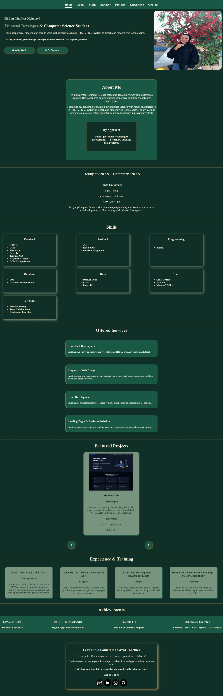

# Updated-Portfolio

Welcome to my personal portfolio!
This website showcases my skills, projects, experience, services, and achievements as a Computer Science student and aspiring Frontend Developer.

##  Live Demo

[View My Portfolio] (https://ghofranmohamed2006.github.io/Updated-Portfolio/index.html)

##  About The Project

This portfolio was created to introduce myself, highlight my technical skills, and showcase the projects I have worked on while developing my experience in web development.

The website has a clean, responsive design that works across desktop, tablet, and mobile devices.

##  Preview



##  Features

*  Home section with a brief introduction
*  About Me section
*  Education section
*  Skills section
*  Services section
*  Projects showcase
*  Experience section
*  Achievements section
*  Contact section
*  Fully responsive design
*  Responsive hamburger menu
*  Smooth scrolling navigation
*  Active navigation link indicator
*  Project cards slider with Previous/Next buttons

##  Technologies Used

* HTML5
* CSS3
* JavaScript
* Responsive Web Design
* CSS Media Queries

##  Design

The portfolio uses a dark green color palette with beige and gold accents to create a simple, elegant, and professional look.

### Color Palette

```text
Dark Green   #102F27
Green        #185844
Light Beige  #F2EBDD
Soft Green   #78947F
Gold         #B08A4F
```

##  Project Structure

```text
Portfolio/
│
├── index.html
├── style.css
├── script.js
│
├── assests/
│   └── ...
│
└── README.md
```

##  Responsive Design

The portfolio is designed to provide a good user experience on:

*  Desktop
*  Mobile
*  Tablet

The navigation bar also includes a responsive hamburger menu for smaller screens.

##  Projects

Some of the projects showcased in this portfolio include:

* Cafe Website
* Todo List
* Student Hub
* Freelance Hub
* Restaurant Ordering App
* Clothes Shop

Each project demonstrates different skills and concepts I have learned throughout my web development journey.

##  Purpose

The main purpose of this portfolio is to:

* Showcase my technical skills
* Present my projects
* Share my learning journey
* Connect with potential clients and opportunities
* Continue improving my frontend development skills

##  About Me

I am a Computer Science student passionate about web development and continuously learning new technologies.

I enjoy building responsive, user-friendly websites and turning ideas into functional web experiences.

##  Contact

If you would like to connect with me or discuss a project, feel free to reach out through the contact information provided on my portfolio.

---

Made by **Ghofran Mohamed**

